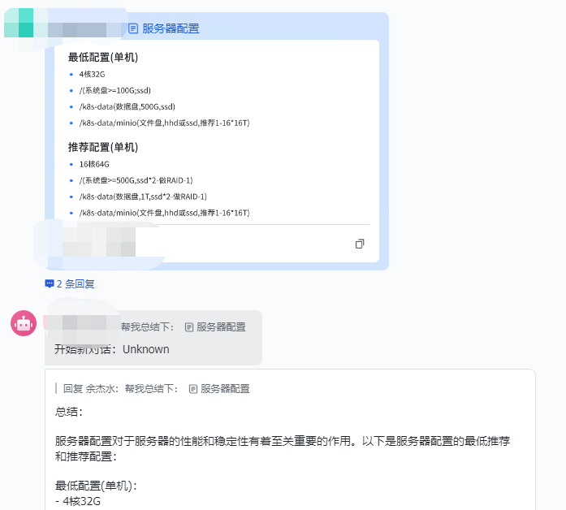

# feishu机器人+chatgbt


### 支持读取云文档内容


## 飞书配置:
见：https://github.com/ConnectAI-E/Feishu-OpenAI#%E8%AF%A6%E7%BB%86%E9%85%8D%E7%BD%AE%E6%AD%A5%E9%AA%A4


## 启动
```shell
git clone https://github.com/1178615156/feishu-chatgbt
docker build -t 1178615156/feishu-chatgbt . 

docker run -it --name feisu-chatgbt \
  -e API_URL='https://api.openai.com' \
  -e API_KEY='sk-xxxxxxxxxxxxxxxxxxx' \
  -e BOT_NAME='chatgbt' \
  -e APP_ID='<APP_ID>' \
  -e APP_SECRET='<app_SECRET>' \
  -e VERIFICATION_TOKEN='<VERIFICATION_TOKEN>' \
  -e ENCRYPT_KEY='<ENCRYPT_KEY>' \
  1178615156/feishu-chatgbt

```
### 参数说明
| 变量                 | 值                     |
|--------------------|-----------------------|
| API_URL            | openai的url，可以是各种中转代理  |
| API_KEY            | key                   |
| BOT_NAME           | 飞书机器人的名字，@他的是否才会回复    |
| APP_ID             | 飞书APP_ID              |
| APP_SECRET         | 飞书app_SECRET          |
| VERIFICATION_TOKEN | 飞书VERIFICATION_TOKEN  |
| ENCRYPT_KEY        | 飞书VERIFICATION_TOKEN  |